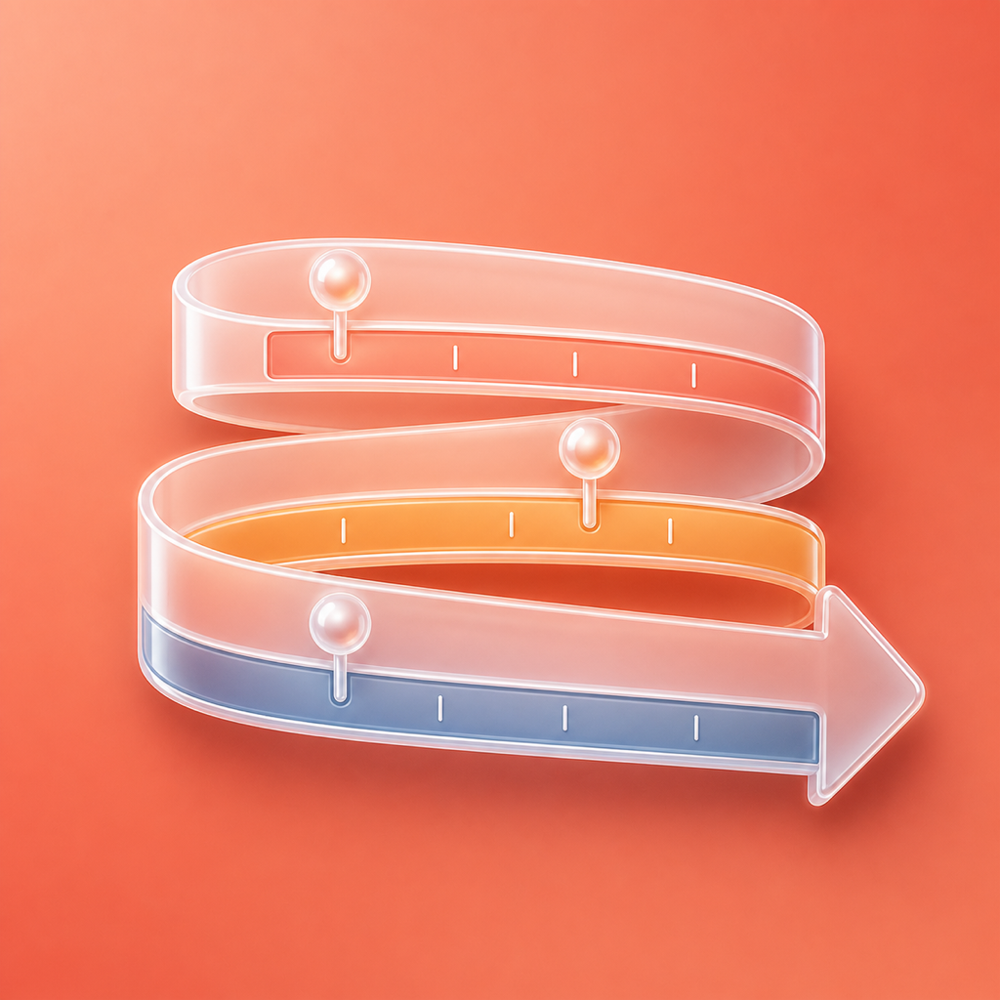

<p align="center">
  
</p>

<h1 align="center">KronoFrise</h1>

<p align="center">
  <strong>L'éditeur de frises chronologiques qui donne envie d'enseigner l'Histoire.</strong><br/>
  Pensé pour les professeurs, aimé pour sa simplicité — du tableau à l'impression en quelques clics.
</p>

<p align="center">
  
  
  
  
  
</p>

<p align="center">
  <a href="#-pourquoi-kronofrise">Pourquoi</a> •
  <a href="#-ce-que-vous-pouvez-faire">Fonctionnalités</a> •
  <a href="#-démarrer-en-30-secondes">Démarrer</a> •
  <a href="#-comment-ça-marche">Comment ça marche</a> •
  <a href="#-architecture-technique">Architecture</a>
</p>

---

## ✨ En bref

> **KronoFrise remplace la feuille Word bricolée et le générateur de frises en formulaire.**
> Ici, la frise *est* l'éditeur : vous cliquez pour poser un événement, vous faites glisser pour tracer une période, vous zoomez de la Préhistoire à aujourd'hui. Tout ce que vous voyez à l'écran est exactement ce qui s'imprimera.

| Avant | Avec KronoFrise |
|---|---|
| Saisir des dates dans un formulaire et croiser les doigts pour la mise en page | Cliquer-glisser directement sur l'axe, les étiquettes s'empilent toutes seules |
| Une échelle linéaire illisible de -3 000 000 à 2026 | Un **axe élastique** : la Préhistoire compressée, le XXᵉ siècle dilaté, avec une coupure élégante ⫽ |
| Refaire la frise à la main pour une fiche élève | Un clic : masquer les dates, les libellés, ou la moitié au hasard — le corrigé reste intact |
| Exporter un PNG flou | Exporter un **PDF vectoriel** paginé, une page web interactive, un SVG ou un PNG net en 1×/2×/3× |

---

## 🎯 Pour qui ?

*   **Professeurs d'histoire-géographie** (cycle 3 → lycée) qui veulent une frise propre à projeter, à afficher au mur ou à distribuer en fiche.
*   **Élèves** — via le mode *Fiche élève* et les fiches à découper générées automatiquement.
*   **Toute personne** qui a déjà souffert pour aligner des dates dans un traitement de texte.

Aucun compte à créer. Tout est local, tout est à vous.

---

## 🖥️ Ce que vous pouvez faire

### 1. Éditer — comme dans Figma, mais pour le temps

*   **Création directe** : clic sur l'axe → un événement apparaît, double-clic pour renommer. Glisser horizontalement → une période se trace.
*   **Manipulation naturelle** : déplacer un événement change sa date (infobulle en direct + aimantation sur les années rondes, `⌥` pour désactiver). Tirer le bord d'une période change sa durée. Glisser verticalement change de bande.
*   **Organisation** : bandes (*lanes*) nommées et colorées (ex. *Politique*, *Arts*, *Sciences*), réordonnables, repliables. Plan (*outline*) et recherche intégrés.
*   **Mise en page automatique** : les étiquettes s'empilent sans se chevaucher, de façon déterministe. Besoin de forcer une position ? Épinglez la rangée.
*   **Thèmes** : *Manuel scolaire* (par défaut), *Craie*, *Parchemin*, *Journal* (haute-contraste, photocopie-safe). Chaque thème est un système visuel complet — la frise reste belle sans aucun réglage.
*   **Raffinements** : dates approximatives (`v. 800`), bords flous, trois formes de période (barre, accolade, flèche), images intégrées, palette de 12 couleurs volontairement restreinte pour rester lisible.

### 2. Projeter — le mode Présentation

Passez en plein écran, sans chrome. Parcourez la frise au clavier (`←` / `→`), une fiche par élément avec zoom fluide. Activez **Révéler** : la frise démarre vide et les éléments apparaissent un par un, au rythme de votre cours — comme si vous la dessiniez au tableau.

### 3. Faire travailler — le mode Fiche élève

C'est le super-pouvoir pédagogique hérité (et décuplé) de [micetf.fr/frise](https://micetf.fr/frise/) :

*   Masquer **le libellé**, **la date**, ou **les deux** — par élément ou en un clic pour toute la frise.
*   **Masquer la moitié au hasard** pour une évaluation différenciée en une seconde.
*   **Afficher le corrigé** : la frise complète, sans toucher à vos masques.
*   À l'export, tout est conservé : la fiche + le corrigé dans le même PDF (prêt pour un recto/verso), ou une **fiche à découper** (frise vide + étiquettes mélangées à replacer).

> **Principe cardinal** : masquer ne modifie jamais le document. Un bouton suffit pour tout restaurer.

### 4. Importer / Exporter — sans friction

| Entrée | Sortie |
|---|---|
| **Fichier `.krono`** (format natif) | **PDF vectoriel** — A4/A3, portrait/paysage, frise murale paginée (recouvrement 1 cm + repères de coupe) |
| **Export MiCetF** (migration en un dépôt de fichier, couleurs converties) | **Page web interactive** autonome (`.html` unique, offline, navigable) |
| **CSV / TSV** ou **collage direct** depuis Excel/Sheets (`date; libellé; description`) | **SVG** et **PNG** 1×/2×/3× (fond transparent optionnel) |
| *Dates intelligentes* : `1515`, `-52`, `14/07/1789`, `v. 800`, `XVIᵉ siècle` | *Fidélité garantie* : tous les exports passent par la même scène que l'écran |

Les lignes illisibles à l'import sont signalées sans bloquer le reste, et tout import est annulable (`⌘Z`).

---

## 🧭 Comment ça marche — les 4 concepts à comprendre

```
  Bande « Politique »  ───────────────────────────────────────────
  │  ┌───────────────┐         ● Sacre de Napoléon
  │  │  Consulat     │         │ 1804
  │  └───────────────┘         │
 ═╪════╪════╪════╪════╪════╪═══╪══╪════╪════╪════╪═══════════════  ← l'axe
  1795      1800           1805    1810
         ⫽  coupure (axe élastique)
```

| Concept | Rôle | Exemple |
|---|---|---|
| **Événement** | Un point dans le temps | *14 juillet 1789 — Prise de la Bastille* |
| **Période** | Une durée (barre, accolade ou flèche) | *1804 – 1814 : Premier Empire* |
| **Bande** | Une ligne horizontale qui regroupe | *Politique*, *Arts*, *Sciences* |
| **Axe élastique** | L'échelle du temps, découpée en segments de densités différentes | 4 segments pour *grandes-periodes.krono* : -3 000 000 → 2026, Préhistoire tassée, époque contemporaine dilatée |

**L'axe élastique** est la signature de KronoFrise : une frise de la Préhistoire à nos jours est impossible en linéaire. Découpez l'axe en jusqu'à 8 segments, chacun avec sa propre largeur relative. Entre deux segments, une coupure ⫽ apparaît — faites-la glisser pour redistribuer l'espace, double-cliquez pour la modifier ou la supprimer.

---

## 🚀 Démarrer en 30 secondes

### Utiliser l'application

```bash
pnpm install
pnpm dev
```

Ouvrez http://localhost:5173 — `/` est l'éditeur, `/?fixtures` affiche la galerie de contrôle.

> **Raccourcis qui changent tout** : `E` armer un événement · `P` armer une période · `⌘Z` / `⇧⌘Z` annuler/refaire · `⌘D` dupliquer · flèches pour décaler d'un cran (`⇧` ×10) · `Espace` + glisser pour naviguer · `⌘1` / `⌘2` basculer plan/inspecteur.

### Commandes disponibles

| Commande | Effet |
|---|---|
| `pnpm dev` | Serveur de développement Vite |
| `pnpm test` | Suite Vitest (noyau, échelle, mise en page, rendu, export PDF) |
| `pnpm lint` | ESLint avec règle de frontière `core`/`layout` |
| `pnpm build` | Vérification TypeScript + build de production |
| `pnpm fixtures:emit` | Régénère les `.krono` depuis les fixtures TypeScript |
| `pnpm samples` | Exporte les fixtures en PDF, SVG et page web (contrôle visuel) |

### Prérequis

Node.js ≥ 20, [pnpm](https://pnpm.io/) ≥ 9.

---

## 🎨 Thèmes & palette

Quatre thèmes livrés, un même document rendu différemment :

*   **Manuel scolaire** — clair, sobre, prêt à imprimer (défaut)
*   **Craie** — fond ardoise, idéal en projection
*   **Parchemin** — tons chauds, parfait pour l'Antiquité / Moyen Âge
*   **Journal** — noir & blanc ultra-contrasté, **résiste à la photocopieuse**

La palette d'éléments compte 12 couleurs (*Brique, Ocre, Blé, Olive, Forêt, Canard, Ardoise, Encre, Prune, Lie-de-vin, Terre, Pierre*) + 5 teintes figées pour les grandes périodes officielles. Chaque couleur dérive de façon déterministe son fond (`tint`) et son encre (`ink`) — lisibilité 4.5:1 garantie.

---

## 📦 Le format `.krono`

Un fichier `.krono` est un JSON versionné (`krono/1`), lisible et durable :

*   Dates en **année astronomique** (`1` = an 1, `0` = 1 av. J.-C.) avec précision optionnelle mois/jour + drapeau `circa`.
*   Axe à segments pondérés, bandes, événements/périodes, pédagogie (masques) — rien d'autre.
*   Images embarquées en data-URL (max 512 px, ≤ 20 Mo par document).

> Toute la doc du format, les invariants et les contrats `core/` sont dans [`docs/format.md`](docs/format.md).

---

## 🏗️ Architecture technique

```
src/
├── core/       modèle de document, dates, schéma zod, commandes, historique,
│               pédagogie, importateurs (MiCetF, CSV), fixtures
├── layout/     échelle segmentée (temps ⇄ pixels), graduations, moteur de mise en page
├── renderer/   SceneGraph → SVG (écran et export headless)
├── export/     PDF vectoriel, page web interactive, SVG, PNG, pagination
├── themes/     thèmes en données pures
├── shared/     chaînes et palette pures, sans dépendance à l'interface
├── ui/         éditeur, interactions, jetons, entrées chaînes/palette
└── store/      store zustand, commandes, autosauvegarde IndexedDB, fichiers
```

**La frontière sacrée** — appliquée par ESLint — : `core/` et `layout/` n'importent jamais React, le DOM ou les couches supérieures.

```
render(layout(document))            // à l'écran
renderToSvgString(layout(document)) // à l'export — même scène, même fidélité
```

*   Autosauvegarde continue dans IndexedDB (document + pile d'annulation, vignette 400 px).
*   Ouvrir/Enregistrer via File System Access API (fallback téléchargement/upload).
*   Pile d'annulation de 200 commandes, chaque geste = une entrée.

---

## 🗺️ État & feuille de route

**M3 — Les super-pouvoirs du professeur — livré (2026-08-31).**

| Jalon | Contenu | État |
|---|---|---|
| **M0** | Fondations : modèle, dates BC/AD, axe segmenté, rendu SVG de la règle | ✅ |
| **M1** | Canevas vivant : création directe, glisser-déposer, empilement auto, annulation, autosauvegarde | ✅ |
| **M2** | Structure & style : inspecteur, bandes, axe élastique éditable, thèmes, images, minimap | ✅ |
| **M3** | Super-pouvoirs : Fiche élève, Présentation, PDF/paginé, HTML/SVG/PNG, import MiCetF/CSV, navigateur de frises | ✅ |
| **M4** | Polish & desktop : clavier complet, accessibilité, PWA/offline, app Tauri (menus natifs, `.krono` associé) | 🔜 |
| **M5** | Partage & extras : liens de partage, Wikidata, quiz, frises parallèles, export PPTX | 💡 backlog |

Détails et limites connues : [`docs/verification-m1.md`](docs/verification-m1.md), [`docs/verification-m2.md`](docs/verification-m2.md), [`docs/verification-m3.md`](docs/verification-m3.md).

---

## 📚 Documentation

| Document | Pour qui | Ce qu'il tranche |
|---|---|---|
| [`PLAN.md`](PLAN.md) | Vision produit & jalons | Quoi, quand, et avec quelles règles |
| [`DESIGN.md`](DESIGN.md) | Toute décision visuelle | Jetons, métriques, états, microcopie |
| [`docs/format.md`](docs/format.md) | Contrat `core/` | Format `.krono`, commandes, importateurs, fixtures |
| [`docs/spec-gaps.md`](docs/spec-gaps.md) | Points laissés ouverts | Comment chaque ambiguïté a été résolue |

---

## 🤝 Contribuer

Les contributions sont bienvenues — lisez d'abord `PLAN.md §8` (règles pour l'agent implémenteur, valables aussi pour un humain) :

1.  Pas de Tailwind / librairie UI — CSS Modules + jetons de `DESIGN.md`.
2.  Pas de hex en dehors de `tokens.css` / `palette.ts`, pas de chaîne en dehors de `strings.ts`.
3.  Dépendances en liste fermée (voir `PLAN.md §8.4`) — proposer avant d'ajouter.
4.  `core/` et `layout/` restent purs (jamais de React/DOM).
5.  Un commit = une feature ou un fix, tests à l'appui.

```bash
pnpm lint && pnpm test && pnpm build  # doit passer avant toute PR
```

---

## 📄 Licence

Apache 2.0 — voir [`LICENSE`](LICENSE). KronoFrise appartient à ses utilisateurs : vos frises sont vos fichiers.

---

<p align="center">
  <em>Fait avec terre cuite, rigueur typographique et amour de l'Histoire.</em><br/>
  <strong>KronoFrise</strong> — <em>Figma-level editing comfort, purpose-built for chronology.</em>
</p>
